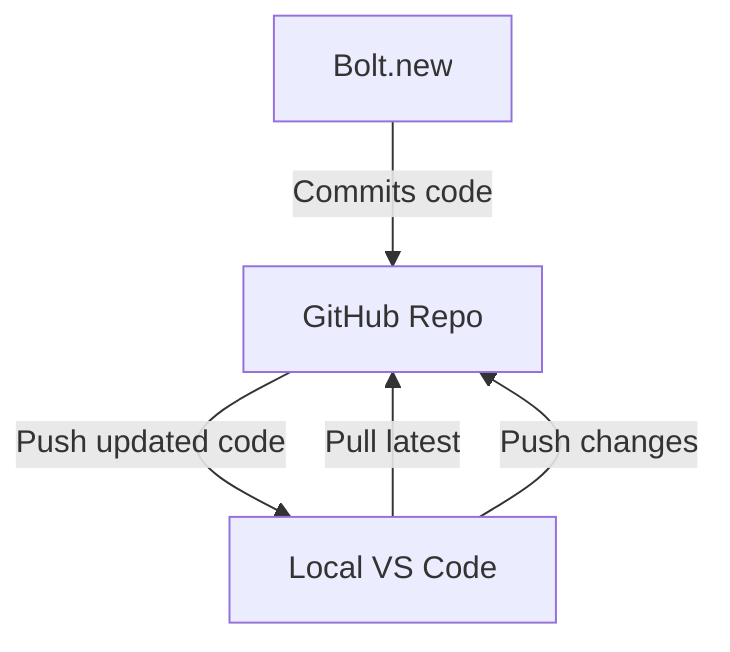

# 🔁 Three-Way Workflow: Bolt + GitHub + Local VS Code

This file documents the operating model for managing code contributions and project updates between Bolt.new, GitHub, and your local VS Code development environment.

---

## 🧭 Source of Truth

The **GitHub repo is the single source of truth** for this project.

- Bolt pushes code directly into the connected GitHub repo.
- You work locally from the latest state in GitHub.
- All updates (from Bolt or local work) must be committed and pushed to GitHub to stay in sync.
- The local GitHub repo is preferred for editing `.md` files and AI-assisted workflows, since it enables sharing and collaboration via ChatGPT.

---

## 🛠️ Local VS Code Workflow

### 1. Pull latest changes from GitHub before making any edits

```bash
git pull origin bolt-migration  # or your active working branch

2. Make your edits

Work locally in VS Code as usual (e.g. editing markdown, styling, components, Supabase queries).

3. Stage and commit changes

git add .
git commit -m "Describe your change here"

4. Push to GitHub

git push origin bolt-migration

This keeps both your local project and the Bolt interface in sync with the GitHub cloud repo — the canonical source of truth.

⸻

---

## 🧩 Visual Workflow Diagram

Below is a diagram showing the three-way workflow between Bolt, GitHub, and your local VS Code environment:



This diagram illustrates the cyclic workflow:
- Bolt pushes directly to GitHub.
- Local VS Code pulls from GitHub to stay in sync.
- Local changes are committed and pushed back to GitHub.
- GitHub remains the single source of truth for both environments.

---

## 🗺️ Workflow Summary Diagram

Below is a visual representation of how code moves across environments:

```mermaid
graph LR
    B[Bolt.new] -->|Commits| G[GitHub (Main Repo)]
    L[Local VS Code] -->|Pull latest| G
    L -->|Push updates| G
    G -->|Reflected in| B
```

- **Bolt.new** pushes directly to GitHub.
- **Local VS Code** pulls from GitHub to stay updated.
- Local commits are **pushed back** to GitHub to reflect changes.
- GitHub acts as the **central source of truth**.
