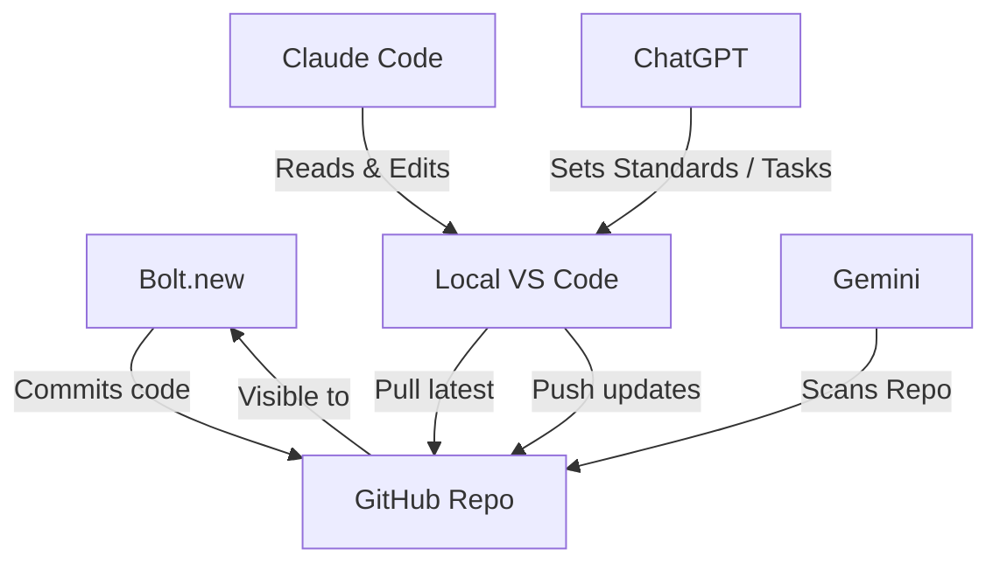

# 🧠 Workflow & Collaboration Guide: Multi-Agent Dev System (ChatGPT, Claude, Bolt, Gemini)

This file documents the operating model for managing code contributions and project updates between Bolt.new, GitHub, and your local VS Code development environment.

---

## 🧭 Source of Truth

The **GitHub repo is the single source of truth** for this project.

- Bolt pushes code directly into the connected GitHub repo.
- You work locally from the latest state in GitHub.
- All updates (from Bolt or local work) must be committed and pushed to GitHub to stay in sync.
- The local GitHub repo is preferred for editing `.md` files and AI-assisted workflows, since it enables sharing and collaboration via ChatGPT.

---

## 🤖 Multi-Agent Development Workflow

This project is developed using a multi-agent collaboration system consisting of five actors:

1. **User** – Project architect and product owner, guiding standards and vision.
2. **ChatGPT** – Long-term memory assistant for structure, standards, documentation, and task sequencing.
3. **Claude Code (in VS Code Terminal)** – File-aware assistant with full-project visibility, useful for synthesis, refactoring, and full-repo reasoning.
4. **Bolt.new** – Live frontend builder used for rapid prototyping, UI development, and pushing working code directly to GitHub.
5. **Gemini** – High-recall static analyzer capable of scanning the entire repo structure to identify legacy naming, inconsistencies, or gaps in refactors.

### Roles

- ChatGPT manages standards (e.g. bolt-migration-standards.md), guides workshop flow, and tracks todos.
- Claude answers project-wide questions, audits code, and helps align component integration.
- Bolt implements code based on specs from documentation and ChatGPT instructions.
- User coordinates across agents, verifies output, and owns architectural decisions.
- Gemini scans the full repo, identifies structural issues, flags legacy patterns, and complements Claude’s code editing by suggesting full-repo improvements.

### Source of Truth & Coordination

- GitHub remains the single source of truth.
- `docs/todo.md` and `docs/bolt-migration-standards.md` serve as coordination anchors.
- ChatGPT, Claude, and Gemini refer to these files to drive implementation, auditing, and instruction.

This structure enables scalable, low-friction implementation with minimal ambiguity and strong alignment between strategy and execution.

## 🛠️ Local VS Code Workflow

### 1. Pull latest changes from GitHub before making any edits

```bash
git pull origin bolt-migration  # or your active working branch

2. Make your edits

Work locally in VS Code as usual (e.g. editing markdown, styling, components, Supabase queries).

3. Stage and commit changes

git add .
git commit -m "Describe your change here"

4. Push to GitHub

git push origin bolt-migration

This keeps both your local project and the Bolt interface in sync with the GitHub cloud repo — the canonical source of truth.

⸻

---

## 🧩 Visual Workflow Diagram

Below is a diagram showing the three-way workflow between Bolt, GitHub, and your local VS Code environment:



This diagram illustrates the cyclic workflow:
- Bolt pushes directly to GitHub.
- Local VS Code pulls from GitHub to stay in sync.
- Local changes are committed and pushed back to GitHub.
- GitHub remains the single source of truth for both environments.

---

## 🗺️ Workflow Summary Diagram

Below is a visual representation of how code moves across environments:

```mermaid
graph LR
    B[Bolt.new] -->|Commits| G[GitHub (Main Repo)]
    L[Local VS Code] -->|Pull latest| G
    L -->|Push updates| G
    G -->|Reflected in| B
```

- **Bolt.new** pushes directly to GitHub.
- **Local VS Code** pulls from GitHub to stay updated.
- Local commits are **pushed back** to GitHub to reflect changes.
- GitHub acts as the **central source of truth**.

---

## 📎 Gemini Integration Notes

Gemini is integrated as a static analysis assistant that can scan up to 1,000 files at once. Use it for:

- Locating all references to deprecated structures (e.g. `day1`, `activity1`)
- Validating alignment with naming conventions
- Summarizing which files need updates
- Supporting refactors that Claude Code then executes in VS Code

Gemini complements Claude by handling broader searches across the repo where full context is needed.
